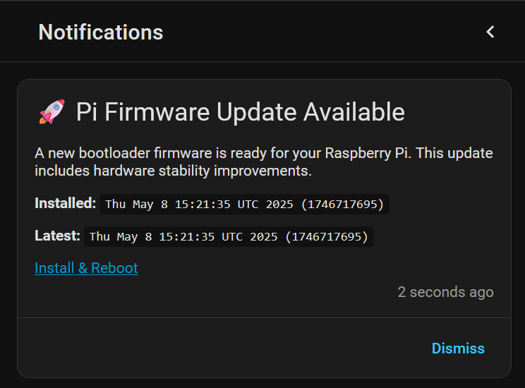

# **🚀 Raspberry Pi Firmware Updater for Home Assistant**

[](https://github.com/ventura8/Home-Assistant-Pi-Firmware-Updater) 

This project provides a professional-grade solution for monitoring and updating Raspberry Pi Bootloader (EEPROM) firmware directly from Home Assistant.

> [!NOTE]
> **AI Agents & Contributors**: Please refer to [Instructions.md](Instructions.md) and the [AI Agent Workflow](docs/ai_workflow.md) for mandatory development guidelines.


This version is structured for **HACS compatibility** and includes an automation script to handle the complex SSH security setup.

## **📸 Screenshots**



Update notification example

## **✨ Features**

* **Real-time Monitoring:** Tracks `CURRENT` and `LATEST` bootloader versions.  
* **Actionable Notifications:** "Install & Reboot" directly from your smartphone.  
* **Persistent Alerts:** Integrated "Bell" notifications on the Home Assistant dashboard.  
* **255-Character Bypass:** Uses optimized SSH piping and string truncation to prevent sensor failure.  
* **Zero-Password Security:** Uses RSA key pairs for secure hardware communication.
* **One-Command Setup:** Automated script for SSH key management and Mobile ID config.

## **📋 Prerequisites**

* \[ \] **Hardware:** Raspberry Pi 4 or 5\.  
* \[ \] **Software:** Home Assistant OS (HAOS) installed (Tested on **Home Assistant OS 2025.12.4**).  
* \[ \] **Add-ons:**  
  1. **Advanced SSH & Web Terminal** (Community Add-ons) \- Required for setup commands.  
  2. **HassOS SSH Port Configurator** \- Required to open Port 22222 on the host.  
* \[ \] **Mobile App (Optional):** Home Assistant Companion app on your mobile device.

## **🛠️ Step 0: Add-on Setup (Critical)**

Before installing the integration, you must configure the system environment.

### **0.1 Install "Advanced SSH & Web Terminal"**

This allows you to run the setup script.

1. Go to **Settings** \> **Add-ons** \> **Add-on Store**.  
2. Search for `Advanced SSH & Web Terminal` (Community Add-ons) and install it.  
3. **Configuration:**  
   * Go to the **Configuration** tab.  
   * Set a `password` or paste an `authorized_keys` string.  
   * Click **Save**.  
4. **Startup:**  
   * Go to the **Info** tab.  
   * Toggle **Show in sidebar** (Required to access the terminal easily).  
   * Click **Start**.

### **0.2 Install "HassOS SSH Port 22222 Configurator"**

This opens the connection to the Raspberry Pi hardware (Host OS).

1. Go to **Settings** \> **Add-ons** \> **Add-on Store**.  
2. Search for `HassOS SSH Port 22222 Configurator` and install it.  
3. **Configuration:**  
   * Go to the **Configuration** tab.  
   * Set a password (e.g., `temp1234`). This is required so the setup script can log in once to install the permanent SSH keys.
   * (Optional) You can also paste your PC's SSH public key if you want direct access from your computer.
   * Click **Save**.  
4. **Execution:**  
   * Go to the **Info** tab.  
   * **CRITICAL:** Turn **OFF** "Protection mode" (This allows the add-on to modify the host boot config).  
   * Click **Start**.  
   * Check the **Log** tab. Once it says "Success", the port is open.

## **🛠️ Step 1: Install via HACS**

1. In HACS, go to **Integrations** \> **Custom Repositories**.  
2. Add this GitHub URL and select **Integration** as the category.  
3. Install the integration.

## **⚡ Step 2: Automatic Setup & Config**

Once files are installed, open your **Terminal** (from Step 0.1) and run the setup script. It will configure the SSH keys between the container and the host, and prompt you for your Mobile App ID.

```bash
bash /config/custom_components/pi_firmware_updater/install.sh
```
> [!Note]
> When the script attempts to authorize the key, it may ask for the **password** you set in Step 0.2. Enter it to complete the secure handshake.

> [!Note]
> The script will ask for your `notify.mobile_app_` ID (found in **Developer Tools \-\> Actions**). It will automatically inject this ID into the automation files for you.

## **📂 Step 3: Register Components**

The script in Step 3 will output a text block. Copy and paste that block into your `configuration.yaml`. It will look like this:  

```yaml
shell_command: !include custom_components/pi_firmware_updater/shell_commands.yaml
command_line: !include custom_components/pi_firmware_updater/command_line_sensors.yaml
template: !include custom_components/pi_firmware_updater/template_sensors.yaml
automation:
  - !include custom_components/pi_firmware_updater/update_notification.yaml
  - !include custom_components/pi_firmware_updater/action_handler.yaml
script: !include custom_components/pi_firmware_updater/apply_pi_firmware_update_script.yaml
```

## **🗑️ Uninstallation**

To remove the SSH keys generated by the installer and revert the configuration files, run the following command in the Terminal:

```bash
bash /config/custom_components/pi_firmware_updater/uninstall.sh
```

> [!WARNING]
> Flashing EEPROM carries inherent risks. Always ensure your system is backed up. This project is provided "as-is" without warranty.
